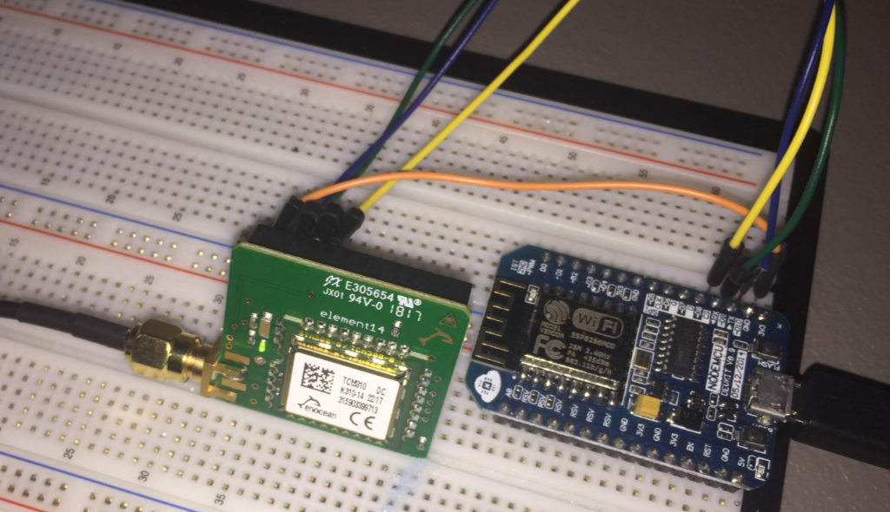

# ESP8266 Enocean

Enocean für den ESP8266, mittels des EnOcean Pi Funkmoduls.



## Verbinden
```
  ESP - ENOCEAN
   TX - RX  10
   RX - TX   8
  Vcc - Vcc  1
  GND - GND  6
```


## Einkaufsliste
- EnOcean Pi Funkmodul - 27€
  - https://www.voelkner.de/products/551086/Raspberry-Pi-Erweiterungs-Platine-EnOcean-Pi-Funkmodul.html
  - 4016138857849
- SMA-Steckverbinder Buchse - 6€
  - https://www.voelkner.de/products/603973/Telegaertner-SMA-Steckverbinder-Buchse-Einbau-vertikal-50-J01151A0931-1St..html
  - 2050001913456
- Antenne 868MHz - 15€
  - https://www.voelkner.de/products/762151/H-Tronic-1618115-Funk-Antenne-Frequenz-868MHz.html
  - 4260003173538
